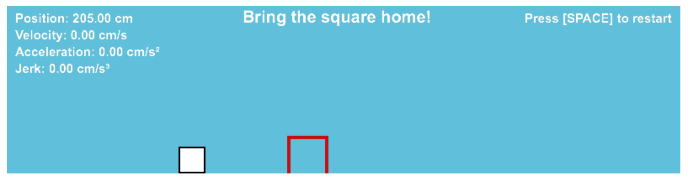

# control-game
A little game in JavaScript to compare velocity, acceleration and jerk bang-bang control.

### index.html
Use the V and B keys to do bang-bang velocity control.  
Use the A and S keys to do bang-bang acceleration control.  
Use the J and K keys to do bang-bank jerk control.

(Jerk control should give you a hard time.)

### optimal.html
Hold the V key down to see the time-optimal velocity control.  
Hold the A key down to see the time-optimal acceleration control.  
Hold the J key down to see the time-optimal jerk control.
